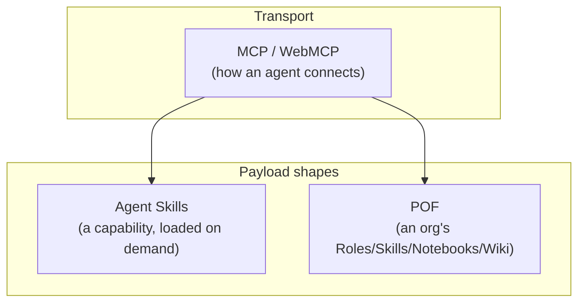

import { Callout } from "nextra/components";

# POF vs. MCP vs. Agent Skills

These three ideas get grouped together constantly, because they show up
in the same sentence about "making agents more capable." They sit next to
each other, though — not on top of each other, and not in competition.

| | What it is | What POF does with it |
|---|---|---|
| **MCP** (and WebMCP) | A connection protocol — how an agent reaches tools and resources at all, regardless of what those tools or resources actually hold. | POF is *content* that gets served over that connection. A reference implementation happens to expose POF over MCP, WebMCP, and a delegated-access flow, all three, at once. |
| **Agent Skills** | A skill-loading mechanism — a folder an agent discovers at startup (name + description only), then reads in full the moment a task matches it. The mental model is called progressive disclosure. | A POF `SKILL.md` is one of four document types — a Skill is a thing an agent can be handed. Roles, Notebooks, and Wiki objects are things an *organization* holds, whether or not any agent ever loads them. |
| **POF** | A content format — a folder of Markdown files with YAML frontmatter, OKF-conformant. | Portable across any transport above. This isn't the only possible implementation of the format, and it doesn't need to be. |

Put plainly: **MCP is the wire, Agent Skills is one shape of payload built
for loading a capability on demand, and POF is a broader shape of payload
— built for holding what an entire organization knows, not just what one
agent can do.**

## They compose, they don't compete

A POF workspace can be, and in the reference implementation is, served
*over* MCP and WebMCP at once — see [Access surfaces](/surfaces). Nothing
about POF as a format assumes a particular transport, and nothing about
MCP as a protocol assumes a particular content shape. The relationship
looks like this in practice:

A `SKILL.md` written to the Agent Skills format and a `SKILL.md` written
as a POF document type look almost identical on purpose — POF's Skill
type deliberately doesn't reinvent that shape. The difference is scope:
Agent Skills describes *only* the capability-loading case. POF also
covers three other document types that were never about capability
loading in the first place — a Role isn't something an agent "activates,"
it's a description of who's responsible for what, that an agent can read
and act inside of.

## When to reach for which

- Building a client or a server that needs a standard way for an agent to
  *connect* to anything at all → that's MCP's job, and WebMCP's job when
  the connection is a live browser tab rather than a remote endpoint.
- Packaging one specific, repeatable capability an agent should load only
  when relevant → that's what Agent Skills is for, and POF's own Skill
  type is compatible with that same shape.
- Holding an organization's actual knowledge — who's responsible for
  what, how something gets done, an ongoing research thread, a directory
  of external entities — in a form both people and agents can read and
  write without translation → that's the gap POF fills, and it's a
  different gap than either of the other two.

<Callout type="warning">
  None of this is a claim that POF is a competing standard to MCP or
  Agent Skills. It's a much narrower, much newer idea — a content shape,
  illustrated by one real implementation — offered for the same reason
  Agent Skills was: because naming a shared shape makes it reusable
  across more than one project.
</Callout>
