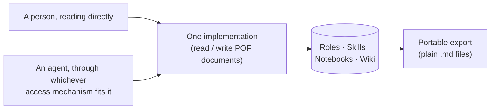

import { Cards } from "nextra/components";

# POF

**Portable Organization Format** — a content format for the knowledge and
execution layers of any organization. Plain Markdown files with a YAML
frontmatter block, conformant to [OKF](https://github.com/GoogleCloudPlatform/knowledge-catalog/blob/main/okf/SPEC.md)
(Open Knowledge Format) v0.2, meant to be read equally well by a person, a
script, or an agent.

Here's what one of those files actually looks like — a Role:

```yaml filename="roles/support/customer-support-lead/ROLE.md"
---
type: Role
title: Customer Support Lead
name: customer-support-lead
team: support
---

# Identity

The first point of contact for anything a customer brings up — a bug
report, a billing question, a complaint that's really a feature request
in disguise. Not expected to resolve everything alone, but expected to
make sure nothing sits unanswered for long.

# Operating frame

Works out of the shared support inbox and the team's running Notebook of
open issues. Checks in at least twice a day, more often during a launch
week. Escalates to engineering only after the documented workarounds have
already been tried.

# Purpose

Keep the gap between "a customer said something" and "someone
acknowledged it" as short as it can reasonably be, without burning out
the person doing it.

# Rules

Never close a ticket without a reply the customer can actually read as an
answer. Never promise a fix timeline that hasn't been confirmed by
whoever's doing the fixing.
```

Nothing about that file is special to this project. It's a folder and a
`.md` file — the same shape whether a human opens it in a text editor, a
build script parses it, or an agent reads it as one document. That's the
whole idea.

## Knowledge that already existed, given one shape

Every organization already has roles, repeatable procedures, ongoing
research threads, and a directory of who and what it deals with — most of
it scattered across chat threads, tribal memory, and documents that only
make sense to whoever wrote them. POF doesn't invent this knowledge. It
gives the shapes that knowledge usually takes — a role, a skill, a
notebook, a wiki entry — one consistent format, so that shape can be read
the same way regardless of what's doing the reading. See
[The format](/format) for the four shapes in full.

## One format, reachable more than one way



A reference implementation happens to expose these documents through
three different access mechanisms at once — see
[Access surfaces](/surfaces) for how each one actually works. That's a
detail sitting on top of the format, though, not the format itself. What
matters conceptually is simpler: one shape for the data, one
implementation behind however many doors reach it — see
[Why POF](/concepts/why-pof#one-source-of-truth-per-action) for why that
constraint is the actual point.

## Ownership, not lock-in

The format's second word carries as much weight as its first. Everything
built with POF exports as plain files — nothing proprietary, nothing that
only one particular app can open. See [Why POF](/concepts/why-pof) for
the reasoning behind treating knowledge as portable data first, product
second.

<Cards>
  <Cards.Card title="Quickstart" href="/quickstart">
    Try it hands-on: create a Role, call a tool, export the result.
  </Cards.Card>
  <Cards.Card title="Why POF" href="/concepts/why-pof">
    The thinking behind treating knowledge as portable data first.
  </Cards.Card>
  <Cards.Card title="The format" href="/format">
    Every field, on every document type, with worked examples.
  </Cards.Card>
  <Cards.Card title="Access surfaces" href="/surfaces">
    WebMCP, delegated access, and the remote MCP server, compared.
  </Cards.Card>
</Cards>
